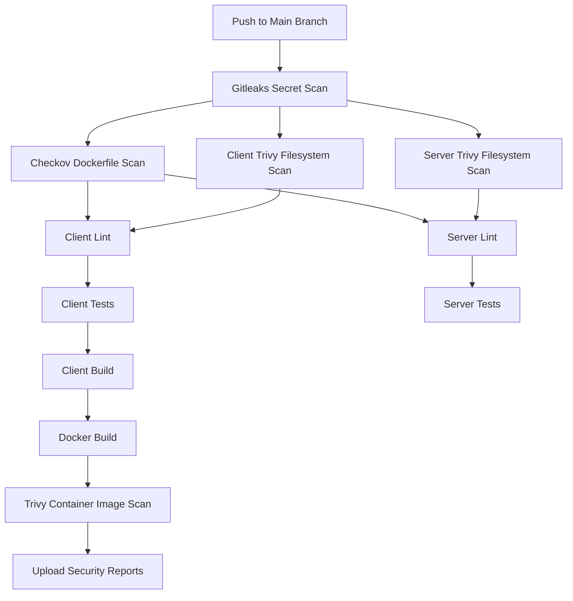

# Enterprise DevSecOps CI/CD Pipeline

## Overview

This repository implements an **Enterprise DevSecOps CI/CD Pipeline** using GitHub Actions. The pipeline integrates security scanning, code quality checks, testing, build automation, container security validation, and Docker image creation.

The workflow follows a **Shift-Left Security** approach by introducing security controls early in the software development lifecycle.

---

## Pipeline Features

### Security Scanning

* Secret detection using **Gitleaks**
* Dockerfile security analysis using **Checkov**
* Filesystem vulnerability scanning using **Trivy**
* Container image vulnerability scanning using **Trivy**

### Code Quality

* Client-side linting
* Server-side linting

### Testing

* Client unit/integration tests
* Server unit/integration tests

### Build & Packaging

* Client application build
* Docker image build
* Multi-platform Docker Buildx support

### Artifact Management

Security reports are uploaded as GitHub Action artifacts:

* Gitleaks Report
* Checkov Dockerfile Report
* Client Trivy Reports
* Server Trivy Reports
* Container Image Trivy Reports

---

## Workflow Trigger

The pipeline executes automatically when changes are pushed to the `main` branch.

```yaml
on:
  push:
    branches:
      - main
```

### Monitored Paths

```text
client/**
server/**
.github/workflows/main.yaml
```

---

# Pipeline Architecture



---

# Pipeline Stages

## 1. Gitleaks Secret Scan

Detects:

* API Keys
* Access Tokens
* Passwords
* Credentials
* Sensitive information committed to source code

### Output

```text
gitleaks-report.json
```

---

## 2. Checkov Dockerfile Scan

Performs Infrastructure-as-Code security checks against Dockerfiles.

Checks include:

* Root user execution
* Image hardening
* Security best practices
* Misconfigurations

### Output

```text
checkov-dockerfile-report.json
```

---

## 3. Trivy Filesystem Scan

### Client Scan

```text
./client
```

### Server Scan

```text
./server
```

Scans:

* Vulnerable dependencies
* Known CVEs
* Misconfigurations

### Severity Levels

```text
HIGH
CRITICAL
```

### Generated Reports

```text
client-trivy-fs-report.json
client-trivy-fs-report.txt

server-trivy-fs-report.json
server-trivy-fs-report.txt
```

---

## 4. Linting Stage

### Client Lint

```bash
npm run lint
```

### Server Lint

```bash
npm run lint
```

Purpose:

* Code quality enforcement
* Style consistency
* Static analysis

---

## 5. Testing Stage

### Client Tests

```bash
npm test
```

### Server Tests

```bash
npm test
```

Purpose:

* Verify functionality
* Detect regressions
* Validate code changes

---

## 6. Build Stage

### Client Build

```bash
npm run build
```

Build artifacts are generated for production deployment.

---

## 7. Docker Build & Push

### Docker Buildx

The pipeline uses:

* Docker Buildx
* QEMU

to support advanced container builds.

### Image Tags

```text
albin666/nodejs-app:${GITHUB_SHA}
albin666/nodejs-app:latest
```

---

## 8. Container Security Scan

After image creation, Trivy performs a container image vulnerability scan.

### Scan Target

```text
albin666/nodejs-app:${GITHUB_SHA}
```

### Severity

```text
HIGH
CRITICAL
```

### Reports

```text
image-trivy-report.json
image-trivy-report.txt
```

---

# GitHub Secrets & Variables

## Repository Secrets

| Secret          | Description             |
| --------------- | ----------------------- |
| DOCKERHUB_TOKEN | Docker Hub Access Token |

## Repository Variables

| Variable           | Description         |
| ------------------ | ------------------- |
| DOCKERHUB_USERNAME | Docker Hub Username |

---

# Technologies Used

| Tool           | Purpose                      |
| -------------- | ---------------------------- |
| GitHub Actions | CI/CD Automation             |
| Gitleaks       | Secret Detection             |
| Checkov        | Dockerfile Security Scanning |
| Trivy          | Vulnerability Scanning       |
| Docker         | Containerization             |
| Docker Buildx  | Advanced Docker Builds       |
| Node.js        | Application Runtime          |

---

# Security Strategy

The pipeline follows DevSecOps principles:

### Source Code Security

* Gitleaks Secret Scanning

### Dependency Security

* Trivy Filesystem Scanning

### Container Security

* Dockerfile Security Validation
* Container Image Vulnerability Scanning

### Continuous Validation

* Automated checks on every push to main

---

# Artifacts Generated

| Artifact                     |
| ---------------------------- |
| gitleaks-report              |
| checkov-dockerfile-report    |
| client-trivy-fs-json-report  |
| client-trivy-fs-table-report |
| server-trivy-fs-json-report  |
| server-trivy-fs-table-report |
| image-trivy-json-report      |
| image-trivy-table-report     |

---

# Prerequisites

* GitHub Repository
* Docker Hub Account
* Node.js Application
* Dockerfile
* GitHub Actions Enabled

---

# Running Locally

Install dependencies:

```bash
cd client
npm install

cd ../server
npm install
```

Run tests:

```bash
npm test
```

Build application:

```bash
npm run build
```

Build Docker image:

```bash
docker build -t nodejs-app .
```

Run container:

```bash
docker run -p 3000:3000 nodejs-app
```

---

# Future Enhancements

* SonarQube Integration
* OWASP Dependency Check
* Kubernetes Deployment
* GitHub Security Dashboard Integration
* Slack Notifications
* AWS EKS Deployment
* Automated Release Versioning

---


